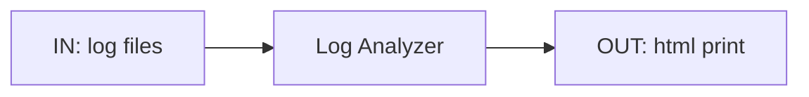
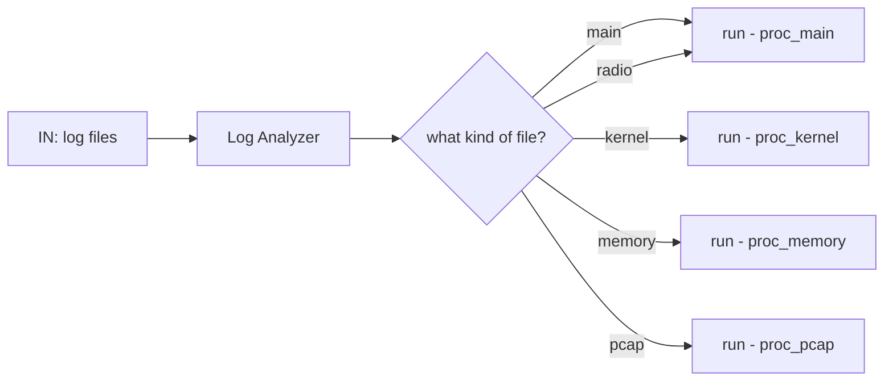

## Log Analyzer Tool

### Overview

### pre processing


### processing of parsing
```mermaid
graph LR
A[IN: logfiles] -->B(proc_***)
C[IN: key_words.csv] -->B(proc_***)

B --> F[OUT: timeline_top*.csv]
B --> G[OUT: timeline_proc*.csv]

	```
### processing of html output
```mermaid
graph LR

J[IN: timeline_**.csv] --> H(make_html)
H --> O[OUT: result.html]
```

